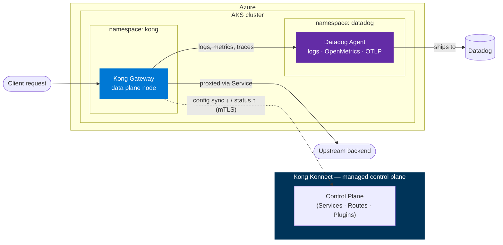
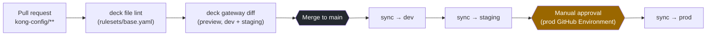

# Azure-Kong-AI-Gateway-IaC


[](https://github.com/upxill/Azure-Kong-AI-Gateway-IaC/actions/workflows/kong-gateway-config.yml)

Two-layer, fully-as-code Kong Gateway platform on Azure:

1. **Infrastructure** (`main.tf` et al.) — provisions an AKS cluster and
   deploys a Kong Konnect Data Plane node (Self-Managed Hybrid), plus a
   Datadog Agent for logs, metrics, and traces, entirely in Terraform. No
   manual `az aks create`, `kubectl create secret`, or `helm install`.
2. **Gateway configuration** (`kong-config/`) — Gateway Services, Routes,
   Plugins and Consumers, declared as reusable, environment-templated YAML
   and synced to Kong Konnect with [decK][deck], instead of clicked
   together in the Konnect UI. Governed by a CI pipeline that lints and
   diffs every pull request and gates production syncs behind manual
   approval.

Nothing about how this proxies traffic lives outside version control —
including the two plugins (`prometheus`, `opentelemetry`) that used to
require a manual step in the Konnect UI before this repo had a
declarative-config layer.

[deck]: https://developer.konghq.com/deck/

## Contents

- [Highlights](#highlights)
- [Architecture](#architecture)
- [What this creates](#what-this-creates)
- [Prerequisites](#prerequisites)
- [Setup](#setup)
- [Deploy the infrastructure](#deploy-the-infrastructure)
- [Configure the gateway (decK)](#configure-the-gateway-deck)
- [Connect kubectl](#connect-kubectl)
- [Test the proxy](#test-the-proxy)
- [Project layout](#project-layout)
- [Sending logs, metrics, and traces to Datadog](#sending-logs-metrics-and-traces-to-datadog)
- [CI/CD](#cicd)
- [Common gotchas](#common-gotchas)
- [Teardown](#teardown)

## Highlights

- **Infrastructure as Code, end to end.** AKS, the Kong hybrid data plane,
  and the Datadog Agent are one `terraform apply` — no console clicking,
  no undocumented setup steps.
- **APIOps, not ClickOps.** Gateway Services/Routes/Plugins/Consumers are
  declarative YAML in `kong-config/`, synced with decK — the same
  discipline Terraform gives the infrastructure, applied to what the
  gateway actually does with traffic.
- **One codebase, three environments.** Every service, route and plugin is
  defined once and parameterized per environment (dev/staging/prod) with
  decK's native `${{ env "DECK_*" }}` substitution — see
  [`kong-config/README.md`](kong-config/README.md#templating-one-set-of-files-three-environments).
- **CI-gated by design.** Both layers are meant to run through CI: a
  `deck file lint` ruleset (`kong-config/rulesets/base.yaml`) fails a PR
  on missing tags or bad naming before anything is diffed, and prod syncs
  require a manual, environment-protected approval
  (`.github/workflows/kong-gateway-config.yml`).
- **Observability wired in from the start.** Prometheus metrics,
  OpenTelemetry traces, and stdout log collection all ship to a
  Datadog Agent running alongside the data plane — as code, not a
  post-deploy checklist.

## Architecture



**Control plane / data plane split:** Kong Konnect holds the managed
control plane. The AKS cluster runs the self-managed data plane node,
connected over mTLS. Konnect pushes down configuration (Routes, Services,
Plugins) — populated by `kong-config/` via decK, not hand-entered; the
data plane node executes it and reports status back.

**Request flow:** a request enters the data plane node and is matched to a
Route, which runs any attached Plugins (this is where `prometheus` and
`opentelemetry` execute), then is proxied via a Service to the backend
upstream.

**Telemetry:** the same Plugins stage sends logs, metrics, and traces to
the Datadog agent, which runs alongside the data plane node in the same
AKS cluster (separate `datadog` namespace) — in parallel with the request
continuing on to the backend.

**Config delivery (APIOps):** `kong-config/` is a separate pipeline from
the Terraform above — see
[Configure the gateway (decK)](#configure-the-gateway-deck) and
[CI/CD](#cicd).



## What this creates

**Infrastructure** (`terraform apply`):
- Azure Resource Group
- AKS cluster (`azurerm_kubernetes_cluster`)
- Kubernetes namespace `kong` + TLS secret for Data Plane ↔ Control Plane mTLS
- Kong Gateway Helm release, configured as a data plane node
- Kubernetes namespace `datadog` + API key secret
- Datadog Agent DaemonSet (`datadog/datadog` Helm chart) — log collection,
  OpenMetrics scraping, OTLP receiver for traces, process agent

**Gateway configuration** (`make kong-sync-<env>`, via decK):
- 3 Gateway Services (`httpbin`, `users-api`, `orders-api`) across 5 Routes
- 9 Plugin instances — global (`prometheus`, `opentelemetry`,
  `correlation-id`, `request-size-limiting`) and per-route/service
  (`cors`, `rate-limiting` ×3, `key-auth`, `hmac-auth`,
  `request-transformer`, `response-transformer`)
- 2 Consumers (`internal-admin-console`, `partner-payments`) with
  key-auth / hmac-auth credentials

## Prerequisites

```bash
brew install terraform azure-cli kubectl
az login
az account set --subscription "<your-subscription-name-or-id>"
```

For the gateway-configuration layer, also install [decK][deck-install]:

```bash
brew install kong/deck/deck   # or see deck-install link below for other platforms
deck version
```

[deck-install]: https://developer.konghq.com/deck/installation/

You'll also need:
- A Kong Konnect account: https://konghq.com/products/kong-konnect
- A Datadog account and API key: **Organization Settings → API Keys** at
  `https://app.datadoghq.com/organization-settings/api-keys`. Note your
  **Datadog site** too (visible in the URL — `datadoghq.com` for US1,
  `datadoghq.eu` for EU1, `us3.datadoghq.com` for US3, `us5.datadoghq.com`
  for US5, `ap1.datadoghq.com` for AP1).

## Setup

1. In Kong Konnect: **Gateway Manager → New Gateway → Self-Managed Hybrid → Kubernetes**.
2. Download the generated certificate and key, and save them as:
   - `certs/tls.crt`
   - `certs/tls.key`
3. Note the **Control Plane endpoint** and **Telemetry endpoint** shown in Konnect.
4. Copy the example vars file:

   ```bash
   cp terraform.tfvars.example terraform.tfvars
   ```

   Fill in your Konnect endpoints, and set the Datadog API key — preferably
   as an environment variable rather than committing it to the file:

   ```bash
   export TF_VAR_datadog_api_key="<your-datadog-api-key>"
   ```

   `kong_helm_values` in `terraform.tfvars` is passed straight through to the
   Kong Helm chart via `yamlencode()`, so it accepts the exact same keys as
   the chart's own `values.yaml` — `image`, `env`, `resources`, `proxy`,
   `admin`, `manager`, `ingressController`, `secretVolumes`, `podAnnotations`, etc.

   > Note: `.tfvars` files don't support function calls like `jsonencode()`.
   > The `podAnnotations` block uses a heredoc (`<<-EOT ... EOT`) with literal
   > JSON text instead — keep that pattern if you add more annotations.

## Deploy the infrastructure

```bash
make init      # terraform init
make plan      # terraform fmt + validate + plan
make apply     # terraform apply
```

(Or plain `terraform init && terraform plan && terraform apply`, if you'd
rather not use the Makefile.) This provisions everything in one pass —
roughly 8–12 minutes end to end. Re-running `make apply` after editing
`kong_helm_values` triggers a rolling restart of the Kong pod automatically
(env vars and annotations only take effect on a new pod, not the running
one).

> **AKS SKU note:** the default `node_vm_size` is `Standard_D4s_v7`.
> Azure's allowed VM sizes vary by subscription/region — if you get a
> `BadRequest: VM size ... is not allowed` error, check the list Azure
> returns in the error and override `node_vm_size` in `terraform.tfvars`.

## Configure the gateway (decK)

Once the data plane node shows connected in Konnect (see
[Connect kubectl](#connect-kubectl) below), push the Gateway Services,
Routes, Plugins and Consumers defined in `kong-config/`:

```bash
export DECK_KONNECT_TOKEN="kpat_..."               # Konnect → Personal Access Tokens
export DECK_KONNECT_CONTROL_PLANE_NAME="<your control plane name>"

make kong-diff-dev     # preview — no changes made
make kong-sync-dev      # apply
```

Full details — the directory layout, how the multi-environment templating
works, the lint ruleset, and how CI drives this in production — are in
[`kong-config/README.md`](kong-config/README.md).

## Connect kubectl

```bash
terraform output -raw kube_config > ~/.kube/kong-demo-config
export KUBECONFIG=~/.kube/kong-demo-config

kubectl get pods -n kong
kubectl get svc -n kong
```

Back in Kong Konnect → Gateway Manager, you should see **"Data Plane node found."**

## Test the proxy

```bash
kubectl get svc my-kong-kong-proxy -n kong
```

After `make kong-sync-dev` has run at least once, the `httpbin` Service +
`httpbin-get` Route from `kong-config/` are live, so there's already
something to hit:

```bash
curl -i http://<EXTERNAL-IP>/httpbin/get
```

For anything beyond the demo route, add a Service/Route/Plugin under
`kong-config/base/` (see
[Extending this](kong-config/README.md#extending-this)) rather than
creating it by hand in Konnect.

## Project layout

```
Azure-Kong-AI-Gateway-IaC/
├── main.tf                     # AKS cluster, Kong namespace/secret/helm_release,
│                                # Datadog namespace/secret/helm_release
├── variables.tf                # all input variables + defaults
├── outputs.tf                  # kubeconfig, cluster name, release status
├── terraform.tfvars.example    # copy to terraform.tfvars and fill in
├── Makefile                    # terraform + decK targets — `make help`
├── .gitignore                  # excludes state, secrets, tfvars, rendered config
├── certs/
│   ├── README.md
│   ├── tls.crt   (you provide this)
│   └── tls.key   (you provide this)
├── kong-config/                 # Gateway Services/Routes/Plugins/Consumers (decK)
│   ├── README.md                #   full usage docs — start here
│   ├── base/
│   │   ├── services/             #   one file per Gateway Service
│   │   ├── routes/                #   one file per Service's Routes
│   │   ├── plugins/                #   one file per Service, + global.yaml
│   │   └── consumers.yaml
│   ├── environments/              # dev.env / staging.env / prod.env — templated values
│   ├── rulesets/base.yaml         # `deck file lint` governance rules
│   └── scripts/                   # render.sh / lint.sh / diff.sh / sync.sh
└── .github/workflows/
    └── kong-gateway-config.yml   # lint+diff on PR, sync dev→staging on main, gated prod
```

## Sending logs, metrics, and traces to Datadog

The `prometheus` and `opentelemetry` plugins (metrics and traces) are
defined as code in
[`kong-config/base/plugins/global.yaml`](kong-config/base/plugins/global.yaml)
and applied by `make kong-sync-<env>` — see
[Configure the gateway (decK)](#configure-the-gateway-deck). They're
global-scoped plugins, so once synced once, they cover every Service and
Route without further setup:

- **`prometheus`** turns on Kong's `/metrics` endpoint, which the
  `podAnnotations` already in `terraform.tfvars` tell the Datadog Agent to
  scrape via OpenMetrics.
- **`opentelemetry`** exports traces to the in-cluster Datadog Agent OTLP
  HTTP receiver, `http://datadog.datadog.svc.cluster.local:4318/v1/traces`
  (templated per environment in `kong-config/environments/*.env` as
  `DECK_OTEL_TRACES_ENDPOINT`). Traces only start appearing for requests
  sent *after* this plugin is synced.

Logs need no extra plugin. Kong's `KONG_PROXY_ACCESS_LOG` /
`KONG_PROXY_ERROR_LOG` env vars (set to `/dev/stdout` / `/dev/stderr` in
`terraform.tfvars`) make Kong write access/error logs to stdout, and the
Datadog Agent's `containerCollectAll` picks up every pod's stdout
automatically — no per-app config needed.

### Verifying it's working

**Confirm the Agent is running:**
```bash
kubectl get pods -n datadog -o wide
```
You should see one `datadog-xxxxx` agent pod per node plus a
`datadog-cluster-agent` pod, all `Running`.

**Confirm Kong is actually writing logs:**
```bash
kubectl logs -n kong -l app.kubernetes.io/instance=my-kong -c proxy --tail=20
```
Send a test request first (`curl` against the proxy) if this is empty.

**Confirm the OpenMetrics scrape is working:**
```bash
kubectl exec -it -n datadog \
  $(kubectl get pod -n datadog -l app.kubernetes.io/component=agent -o jsonpath='{.items[0].metadata.name}') \
  -c agent -- agent status | grep -A 15 openmetrics
```
Look for `Instance ID: openmetrics:kong:... [OK]` with a non-zero
`Metric Samples` count. This confirms Kong's `/metrics` endpoint is being
scraped successfully.

**Confirm the Logs Agent is enabled:**
```bash
kubectl exec -it -n datadog \
  $(kubectl get pod -n datadog -l app.kubernetes.io/component=agent -o jsonpath='{.items[0].metadata.name}') \
  -c agent -- agent status | grep -B2 -A 15 "Logs Agent"
```

**In the Datadog UI:**
- **Logs → Live Tail**, filter `kube_namespace:kong` (Datadog's standard
  namespace tag — not a plain `namespace:kong` guess).
- **Metrics → Explorer**, search `kong_` (the check reports Kong's raw
  Prometheus metric names like `kong_http_requests_total` under this
  prefix). If nothing shows immediately, check **Metrics → Summary**
  instead — it reflects new ingestion faster than Explorer's autocomplete.
- **APM → Traces**, service `kong` (only populated once the OpenTelemetry
  plugin is active and test traffic has been sent since).

## CI/CD

`.github/workflows/kong-gateway-config.yml` runs decK's lint/diff/sync
cycle on every change to `kong-config/`:

| Trigger | What runs |
|---|---|
| Pull request | `deck file render` + `deck file lint` for dev/staging/prod (required check); best-effort `deck gateway diff` against dev/staging |
| Push to `main` | Auto-sync to **dev**, then **staging** |
| Manual dispatch (`environment: prod`) | Sync to **prod**, gated by the `prod` GitHub Environment's required reviewers |

There's no equivalent Terraform pipeline in this repo yet — infra applies
are still run locally with `make apply`. See
[`kong-config/README.md`](kong-config/README.md#cicd) for the full
gateway-config pipeline, including which secrets/variables each
environment needs.

## Common gotchas

- **Config changes not showing up in Datadog:** `terraform apply` must
  actually run again after editing `kong_helm_values` — check
  `terraform plan` shows pending changes to `helm_release.kong` first.
  Env vars and pod annotations only apply to a newly created pod.
- **`Error: Function calls not allowed` on `terraform init`:** `.tfvars`
  files can't call `jsonencode()` or similar functions — use a heredoc with
  literal JSON text instead (see the `podAnnotations` block).
- **`OIDCIssuerFeatureCannotBeDisabled` on `terraform apply`:** Azure now
  enables the OIDC issuer by default on new AKS clusters; `main.tf` sets
  `oidc_issuer_enabled = true` explicitly to avoid Terraform trying to
  "correct" that drift.
- **`A resource ... already exists` on `terraform apply`:** usually means
  you're applying from a fresh directory without the original
  `.terraform`/state, while the Azure/K8s resources from an earlier apply
  still exist. Either apply from the original working directory, or
  `terraform import` the existing resources back into state.
- **`deck gateway sync` fails with `Forbidden` / 401:** `DECK_KONNECT_TOKEN`
  is missing, expired, or doesn't have access to the control plane named
  by `DECK_KONNECT_CONTROL_PLANE_NAME` — regenerate it under Konnect →
  Personal Access Tokens.
- **A `${{ env "DECK_..." }}` value shows up literally instead of being
  substituted:** you ran `deck file render`/`sync`/`diff` without
  `--populate-env-vars`, or the var isn't exported in the current shell —
  `scripts/lib.sh`'s `load_env` handles this for you via
  `make kong-*-<env>`, so this usually means a script was bypassed. See
  [`kong-config/README.md`](kong-config/README.md#templating-one-set-of-files-three-environments).

## Teardown

```bash
make destroy   # terraform destroy
```

Tearing down the infrastructure does **not** remove anything synced to
Konnect — Services/Routes/Plugins/Consumers live in the control plane, not
the cluster. Remove them with decK (`deck gateway sync` an empty state
file) or delete the control plane in Konnect directly if you're done with
it entirely.
